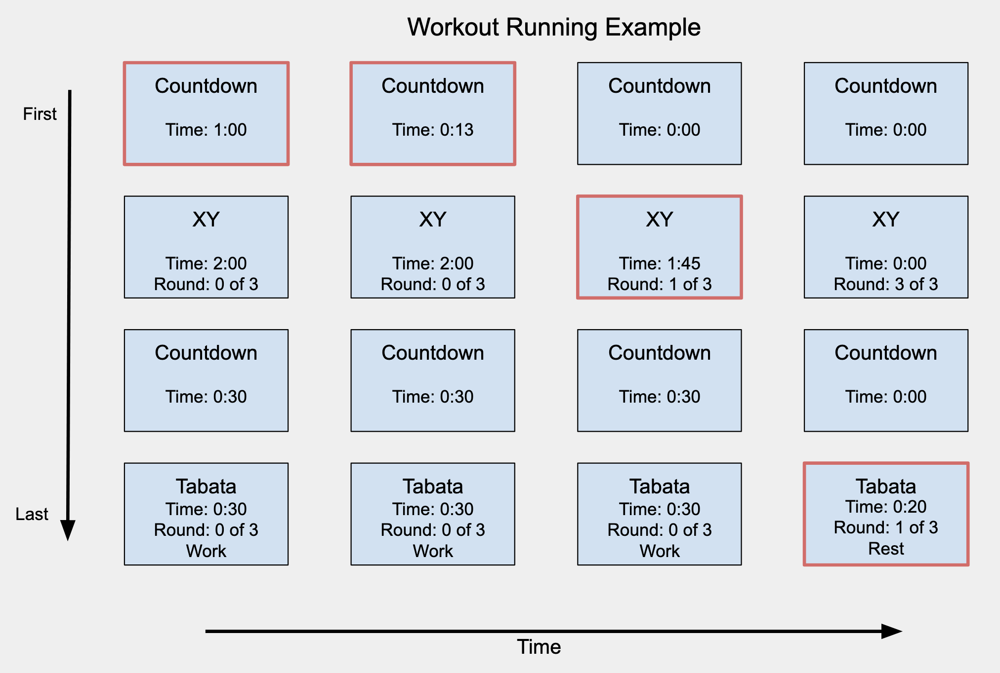

# Objective for Assignment 3

This is the 3rd and last assignment (A3) for E-39 Design Principles in React. Using our timers from Assignment 2 (A2), we will build a workout app that allows our users to assemble **multiple timers** into a workout queue. This workout queue will be executed in the order that the timers were added. Let's take a look at an example:

## Structural Changes to Context

We will have to make changes to our context in order to support the requirements for A3. In A2 we had to store the state of only one timer that we were configuring, now we will have to store all of the timers that the user has configured and the order that the timers will be executed when the user runs the workout. The order that the timers are created is the order in which they are executed.

The choice of data structure should be a queue, which follows First-In-First-Out, and supports the normal enqueue (add item to the queue) and dequeue (removes item from the queue). How you implement the queue is up to you, but things to consider are that:

1. Each timer can be in one of three states: running, completed, and not running. You will need a way to keep track of what state the timer is in, so that you can display it accordingly (see the image above)
2. During configuration, the user can remove any timer from the queue, so you will be supporting deleting
3. While the timer is running, you will need to either store or dynamically calculate which timer is active.
4. You don't want to clear the configurations as the timers are running. The user should be able to restart the entire workout at anytime

## Changes to Routing

Currently we have two routes `/` and `/docs`. We are going to be modifying our `/` screen and add a new one called `/add` using react-router.

### Home - Path should be `/`

- List of timers to be run for a workout. User should be able to remove a timer
- The total time the workout will take
- A button to "Add" a new timer. This button brings the user to the `/add` screen
- Controls to Pause/Resume the workout
- Controls to reset the workout back to its initial state
- Controls to "fast-forward" - ends the current running timer and moves onto the next one

### Add Timer - Path should be `/add`

- When user clicks "Add" from **Home** screen, they are routed to this page, where they can choose the type of timer and configure all inputs for each timer. After configuring, the user confirms and the timer is added to the list.
- The `/add` page should allow the user to configure any of the four timers (stopwatch, countdown, XY, and tabata)
- The user should be able to go back to the home page from here

## Installing and Running the project

As you have noticed this repository is empty. To begin this assignment you must copy over all of our files from A2 into this repo. **Do not copy over the `.git` directory and the `.gitignore` file.**.

## Deliverable

- A user can configure (combination of any timers in any order) and execute a workout
- All four timers must be functional: stopwatch, countdown, tabata, and XY.
- Routing must be configured to support the home route (`/`) and add route (`/add`)
- As you make modifications to your generic components, make sure to update documentation and prop-types.

## Grading Rubric

- A workout can be configured with any combination of timers
- Final workout application should be bug free
- DRY (do not repeat yourself). Try to make sure common code is shared and not copy/pasted
- Console is free of warnings/errors
- Documentation and prop-types are defined and accurate
- Deploy your application

### Deployment Instructions (GH actions)

- Go to `Settings`
- Go to `Pages`
- in `Source`, select `gh-pages` branch
- Click Save
- In `package.json`, add a new key/value as: `"homepage": "https://prof-tejera.github.io/<repo>"`

Once the `build-deploy` action finishes running, the app should be live
at `https://prof-tejera.github.io/<repo>`

For other ways to deploy see https://github.com/prof-tejera/react-deployment-code

## Bonus

- Add full test coverage using Cypress.io. This will require that you get your tests running locally and then add a new Github action that will run the tests every time you commit to GitHub. Note that the Cypress setup is not part of this project and must be configured by you (max 8 points)

## Assignment Notes

- The design for assignment 3 has changed a bit, as I decided to keep both "versions" running and working. This means, that there are some new/extra screens and buttons for guiding the user through the program.
- I have used the helper file as a common file for both colors, statements and functions.
- I have done my best to DRY the code, and have tried to pull out JS in the JSX to functions where it makes sense. When thinking about it, I think it may have made sense to put the common functions that rely on context variables into the relevant context provider, where all the variables are already available. I am not sure whether that is common practice or if there are better ways to do it?
- I have a css file for common styles used by multiple components.
- I have one, common context for the project.

### Concious "omissions":

- I had a version, where I had limited the user input, but had issues making it work on different platforms/devices. In the end, I decided to spend my time on other parts of the code, and allow the user to input very large numbers. I recommend using the spinners, which limit input to a reasonable range (I had disabled keyboard input, but the spinners did not work on mobile out of the box, so I enabled it again).
- The hour "H" is single digited and not limited, which also means that if the "H" number is double-digited (or more), it will only display the last number. This should probably be limited although a 10 hour workout seems a bit excessive.
- The CSS could be more responsive, but again, this was not my focus and can of course be improved.

### Known bugs:

- The queue looses sync with each new timer. After approx 25 timers one second it seems. The loss is between timer rounds, and not on the individual timers. I have not been able to find a solution for this.
- For some reason, when starting the app on localhost the timerType is set correctly from the provider, but when loading it from GH pages, there is no initial timerType set (not a huge problem, but I haven't been able to figure out why)

- References:
  - I used Bootstrap for the layout and for timer icons.
  - I used Styled components for all other CSS
  - I used https://color.adobe.com/create/color-wheel to create a colorscheme, initially with the "split complimentary option", and then fine tuning until I was satisfied with the colors. I wanted a simple, minimalistic, but colorful app design, and took inspiration from different existing apps, as https://play.google.com/store/apps/details?id=cc.dreamspark.intervaltimer&hl=en.
  - I used the supplied article as inspiration for the timer loop: https://overreacted.io/making-setinterval-declarative-with-react-hooks/
  - For the progress indication, I used both text and colors. I would have prefered to use only color for "screen real estate reasons", but due to color blindness concerns, I opted for both. I was inspired by this post + answers: https://ux.stackexchange.com/questions/88528/colours-for-project-status

Link to live version on GH pages: https://prof-tejera.github.io/assignment-3-keamarg/
